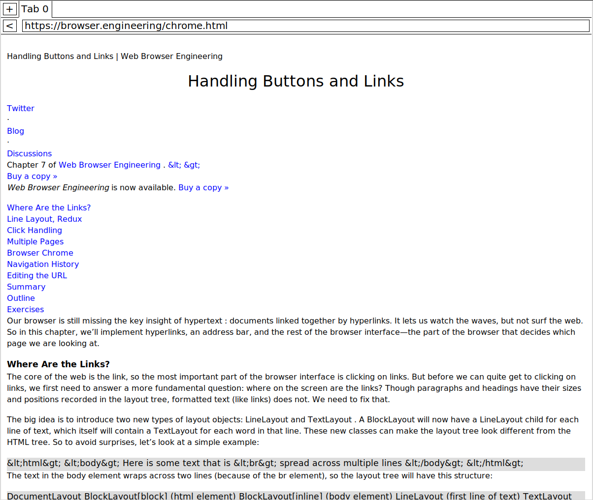

# Web Browser from Scratch
A web browser built from scratch following the book `Web Browser Engineering`

## About the Project

This project is a from-scratch implementation of a functional web browser. The goal was to understand the internal components of a browser - from making HTTP requests to HTML parsing, basic CSS styling, adding interactive elements like links and buttons and so on. 

## Features Implemented
- URL parsing
- Retrieving pages through establishing TCP-based connection with server
- HTML parsing and DOM tree construction
- CSS parsing and basic styling
- Layout engine
- Rendering engine using Tkinter
- Support for tabs, scrolling

## Features To-Be-Added
- Form submission
- Changing DOM and reacting to events
- Support for rendering images
- Zooming
- Cookies and logins 
- and so on ...


<!--  -->

## Getting Started
### Prerequisites
- Python 3.x
- Tkinter

### Build Instructions
To browse a webpage (say homepage of browser engineering book):
```
cd src/
python3 main.py https://browser.engineering/
```

To browse a local HTML test file:
```
cd src/
python3 main.py file://test.html
```

## Current Project Structure

```
.
├── browser-components.png
├── README.md
└── src
    ├── browser.py
    ├── constants.py
    ├── css_parser.py
    ├── layout.py
    ├── layout_tree.py
    ├── layout_tree_simple.py
    ├── lexer.py
    ├── main.py
    ├── parser.py
    ├── resume.html
    ├── test.html
    ├── url.py
    ├── user_agent.css
    └── utils.py

1 directory, 16 files
```

## Screenshot

A chapter from the book [Web Browser Engineering](https://browser.engineering/) rendered using current browser: 



## Assumptions
- The browser doesn't support whitespace-only text nodes. Real browser retain such whitespaces to correctly render make<span> </span>up as two. This browser won't. Ignoring whitespaces simplifies complexities, by avoiding a special case for whitespaces only text tags.
- The browser doesn't support parenthesis in CSS property values. This inhibits us from parsing things like `calc` and `url` functions (are supported in real browsers).
- Each word that will be rendered by the browser will have a single font for all the letters. Hence the browser cannot accomodate letters with different font in between a word.

## References
- [Web Browser Engineering](https://browser.engineering/) by Pavel Panchekha and Chris Harrelson

